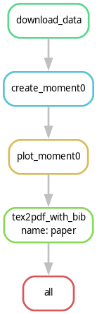
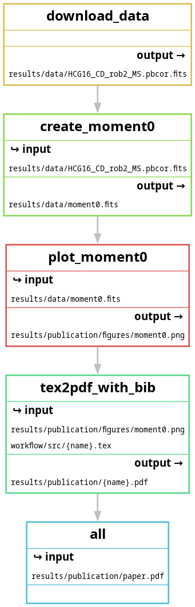

# example-snakemake
Example of a straightforward simple snakemake workflow.

# Run on myBinder.org
[](https://mybinder.org/v2/gh/jmoldon/example-snakemake/HEAD)  
Once the binder virtual machine is ready, open a terminal (at the bottom) and type:
```bash
snakemake -j 1 --use-conda
```

# Local execution
To execute it you need conda installed, and preferably `mamba` (if you don't have `mamba`, just replace the command with `conda`). If you don't have conda installed, you can get it for Linux or MAC with these commands (you only need to do this once for your computer).

```bash
wget "https://repo.anaconda.com/miniconda/Miniconda3-latest-$(uname)-$(uname -m).sh"
bash Miniconda3-latest-$(uname)-$(uname -m).sh
rm ./Miniconda3-latest-$(uname)-$(uname -m).sh
conda install -c conda-forge mamba
```

You can find more details in the [Open Science Droplets](https://droplets-spsrc.readthedocs.io/conda/). If you selected to include init in your bash, you will need to restart the terminal.

Now you can execute the workflow:
```bash
snakemake -j 1 --use-conda
```
# The workflow

Out objective is to download a radio data cube from the VLA and produce an example paper with a single plot of the moment 0 of the cube. The data comes from the publication [Jones et al. 2019](https://ui.adsabs.harvard.edu/abs/2019A%26A...632A..78J/abstract), which repository can be found in [hcg-16](https://github.com/AMIGA-IAA/hcg-16).

The cube is located here: [HCG-16 cube](http://cdsarc.cds.unistra.fr/ftp/cats/J/A+A/632/A78/fits/HCG16_CD_rob2_MS.pbcor.fits)

## Workflow description
The steps of the workflows are sequential:

1. Download the data with wget.
2. Execute [workflow/scripts/create_moment0.py](workflow/scripts/create_moment0.py) to create the moment 0 using [spectral-cube](https://spectral-cube.readthedocs.io/en/latest/).
3. Execute [workflow/scripts/plot_moment0.py](workflow/scripts/plot_moment0.py) to create a png figure of moment 0 fits file using [astropy](https://www.astropy.org/).
4. Compile the latex tex file to produce paper.pdf

## Software used in the workflow
- Job 2 requires the software described in the conda environment [workflow/envs/moment0.yml](workflow/envs/moment0.yml).  
- Job 3 requires the software described in the conda environment [workflow/envs/plotfits.yml](workflow/envs/plotfits.yml).
- Job 4 uses [tectonic](https://tectonic-typesetting.github.io/en-US/), installed with the conda environment [workflow/envs/latex.yml](workflow/envs/latex.yml).

## Workflow diagrams
The DAG of the workflow is this:  



The file dependency graph is this:




